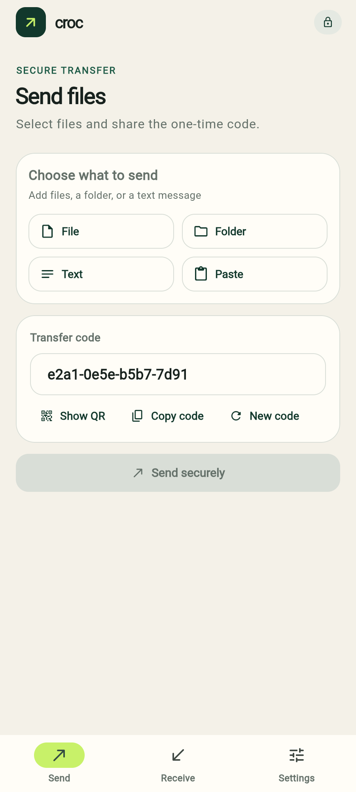
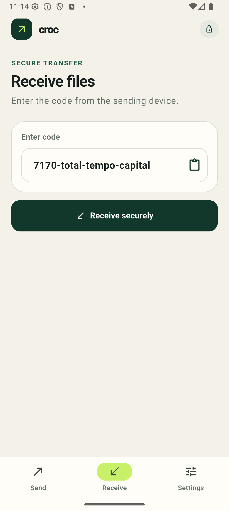
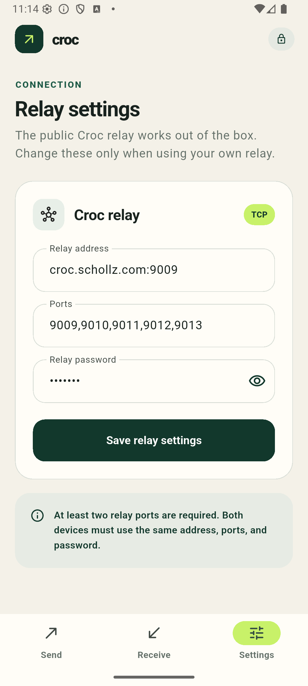
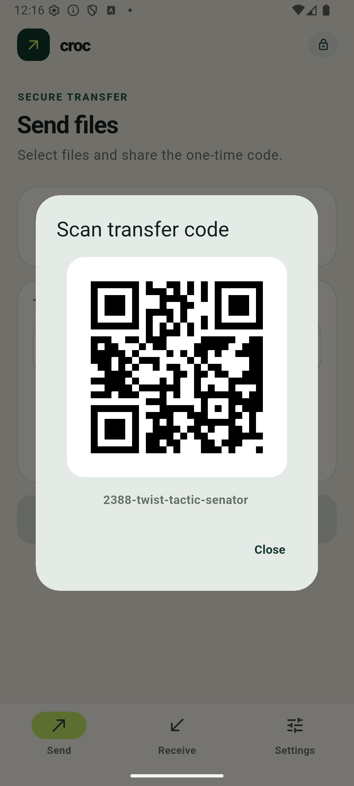
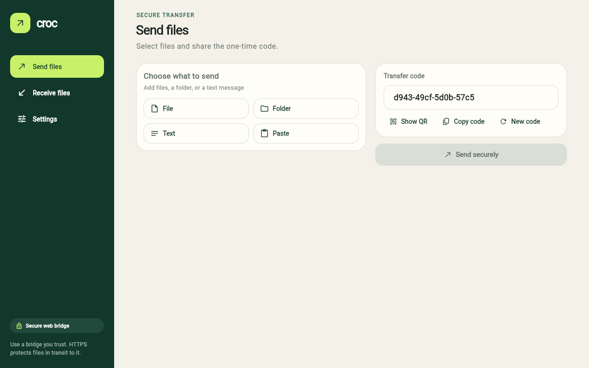
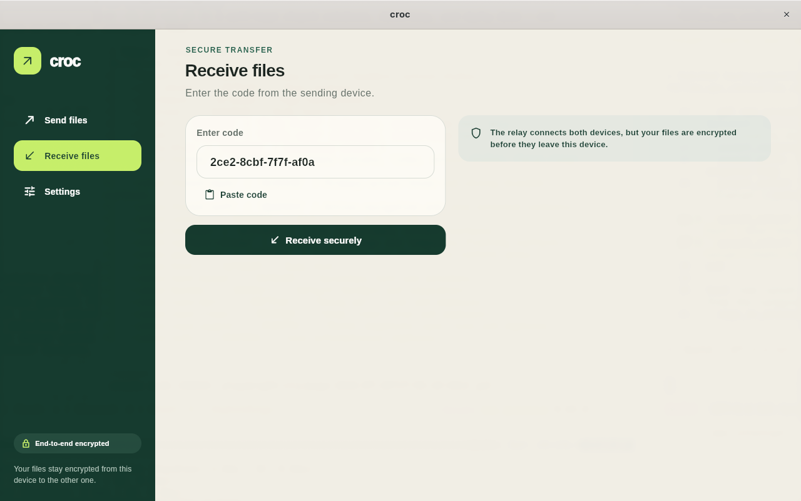

<p align="center">
  
  
  
</p>

# Croc

A Flutter client for [croc](https://github.com/schollz/croc) on Android, Linux, Windows, and the web. Native apps embed the official Go transfer engine. The browser uses the included Go web bridge because browsers cannot connect to Croc's TCP relay directly. Transfers remain fully interoperable with Croc CLI.

## Features

- **Flexible sending** — send files, complete folders, typed text, or clipboard content
- **Receive files** — enter a code to receive from Croc CLI or another client
- **Progress & cancellation** — real-time transfer progress with cooperative cancel
- **QR transfer codes** - show a scannable code or scan one with the Android camera
- **Native Android UX** — document picker, save dialog, and share sheet
- **Desktop transfers** - send and receive encrypted files on Linux and Windows without installing Croc CLI
- **Web transfers** - upload, send, receive, cancel, and download through a self-hosted Croc bridge
- **Custom relay** — configure relay address, ports, and password
- **Adaptive layout** - bottom navigation on phones, compact navigation in small windows, and a two-column workspace on wide Linux and Windows windows

## Screenshots

### Mobile

| Send | Receive | Settings |
|------|---------|----------|
|  |  |  |

<p align="center">
  
</p>

### Desktop

<p align="center">
  
  
</p>

## Architecture

Flutter owns presentation and app state. `native/crocbridge` wraps Croc `v10.4.13`. Android uses a generated gomobile AAR through method and event channels. Linux and Windows bundle a statically linked Go helper and exchange JSON events with it over standard streams. Web builds upload files to `crocbridge-web` over HTTP and stream transfer events back as NDJSON.

Received files are staged in app-private cache storage. Android's Storage Access Framework is used to save copies elsewhere, so the app does not request broad storage permissions.

## Build

Requirements:

- Flutter 3.44 or newer
- Go 1.25 or newer
- Android SDK and NDK configured for Flutter

Generate the native Croc AAR before building the Flutter application:

```bash
./tool/build_croc_bridge.sh
flutter pub get
flutter build apk
```

Desktop builds compile and bundle the Go transfer helper automatically:

```bash
flutter build linux
flutter build windows
```

Build the web app and its bridge, then serve both from one process:

```bash
./tool/build_web.sh
./build/native/web/crocbridge-web --web-root build/web
```

The service listens on `:8080` by default. Configure it with `CROC_WEB_ADDR`, `CROC_WEB_STORAGE`, and `CROC_WEB_ORIGIN`. If the Flutter app and bridge use different origins, build with `--dart-define=CROC_WEB_BRIDGE_URL=https://bridge.example.com` and set `CROC_WEB_ORIGIN` to the exact app origin.

Production deployments must use HTTPS. The web bridge is trusted infrastructure: it receives browser uploads before running Croc, so unlike native clients, Croc's end-to-end encryption starts at the bridge rather than inside the browser. Transfer data is removed one hour after completion.

The generated `android/app/libs/crocbridge.aar` and sources JAR are intentionally ignored. The build script pins the Go Mobile toolchain for reproducible output.

## Verify

```bash
(cd native/crocbridge && go test ./...)
flutter analyze
flutter test
flutter build apk --debug
flutter build linux --debug
flutter build web
(cd native/crocbridge && go test ./...)
```

The desktop process bridge also has a local-relay smoke test. In separate terminals, run:

```bash
croc relay --host 127.0.0.1
flutter test tool/desktop_engine_smoke.dart
```

For an interoperability check, start Receive in the app and send from Croc CLI with the same code:

```bash
CROC_SECRET="your-transfer-code" croc send some-file.txt
```

## Platform Scope

Encrypted sending and receiving are supported on Android, Linux, Windows, and web. Web transfers require the included trusted bridge and support browser file and folder selection, text and clipboard sending, camera QR scanning, cancellation, and downloads. Native Android transfers are end-to-end encrypted from the device; web transfers are HTTPS-protected between browser and bridge, then end-to-end encrypted by Croc from the bridge to the peer. Linux builds are verified locally, while the Windows helper is cross-compiled and the Windows UI is viewport-tested because Windows Flutter binaries must be assembled on a Windows host.

## Licenses

This project uses Croc under the MIT License and references Croc GUI under the ISC License. Full notices are in `third_party/`.
